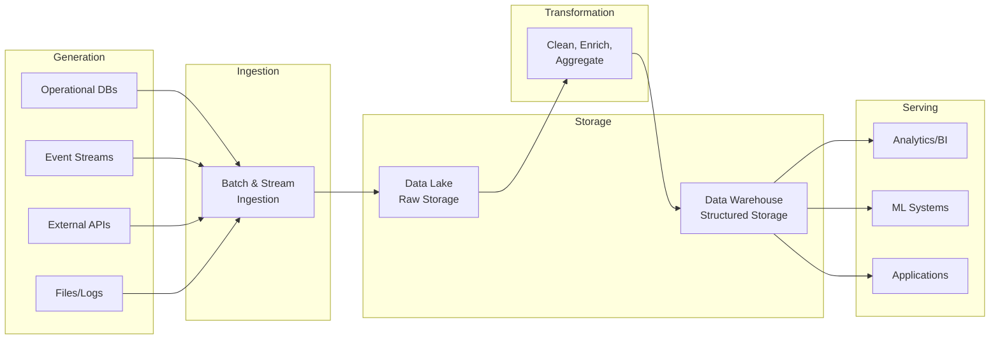

# The Data Engineering Landscape

Consider this scenario: A trading firm captures every order, execution, and market data tick from multiple exchanges. On a typical day, that's 50 million events. During volatile market conditions, it spikes to 500 million. Analysts need yesterday's aggregated metrics by 6 AM. Risk models require minute-level position snapshots with sub-second query latency. A machine learning system needs three years of historical data—properly versioned so backtests don't leak future information into past predictions.

The application database that runs the trading system cannot serve these needs. It's optimized for fast reads and writes of individual records, not for scanning billions of rows to compute aggregations. The data must flow somewhere else, be transformed, and be made available in forms suited to each consumer. This is data engineering.

If you've built production systems, you understand databases, message queues, and distributed systems. What you may lack is a mental framework for thinking about how data flows through an organization—not as isolated technical problems, but as a coherent discipline with its own principles, tradeoffs, and architectural patterns. This chapter provides that framework.

## What Data Engineering Actually Is

Data engineering is often reduced to "building ETL pipelines"—extracting data from sources, transforming it, and loading it into destinations. This definition is technically accurate but misses the point, like defining software engineering as "writing code that compiles."

The actual job is broader: **data engineering is the discipline of making data useful at scale**. This includes:

- **Collecting** data from operational systems, external sources, and events
- **Storing** data in formats and systems optimized for different access patterns
- **Processing** data through transformations that clean, enrich, and aggregate
- **Serving** data to consumers with appropriate latency, freshness, and reliability guarantees
- **Operating** the systems that do all of the above, reliably, at scale, over time

A data engineer's responsibility extends beyond building pipelines to ensuring that data flows reliably from source to consumer, that the systems are maintainable, that costs are controlled, and that the data itself is trustworthy.

### The Distinction from Related Roles

Understanding data engineering requires distinguishing it from adjacent disciplines:

**Software engineers** build applications that generate and consume data. They optimize for user experience, feature velocity, and application reliability. Their data concerns center on the operational database—keeping it fast and consistent for the application's needs.

**Data analysts** explore data to answer business questions. They write SQL queries, build dashboards, and communicate insights. They consume the outputs of data engineering.

**Data scientists** build statistical models and machine learning systems. They need historical data for training, real-time features for inference, and clean datasets for experimentation. They're sophisticated consumers who often push data engineering systems to their limits.

**Machine learning engineers** productionize ML models. They care about feature pipelines, model serving infrastructure, and the feedback loops between predictions and outcomes.

Data engineers sit in the middle, building the infrastructure that connects data producers to data consumers. When a data scientist complains that training data has duplicates, that's a data engineering problem. When an analyst's dashboard shows yesterday's numbers at 3 PM instead of 6 AM, that's a data engineering problem. When the company's cloud bill doubles because someone wrote an inefficient pipeline, that's a data engineering problem.

## The Data Engineering Lifecycle

Raw data becomes useful through a series of stages. Understanding these stages—and the undercurrents that flow beneath them—provides a mental model for reasoning about any data system.

### Stage 1: Generation

Data is generated by source systems: operational databases, application events, third-party APIs, IoT sensors, user interactions. The data engineer typically doesn't control these sources but must understand them deeply.

Key questions at this stage:
- **What format is the data in?** JSON events, database rows, flat files, binary protocols?
- **What's the delivery mechanism?** Real-time stream, batch export, API pull?
- **What guarantees does the source provide?** Can events be duplicated? Out of order? Retroactively modified?
- **Who owns the source?** Internal team, third-party vendor, external system you can't modify?

The generation stage is often the source of the hardest problems in data engineering. A source system's quirks—inconsistent timestamps, schema changes without notice, occasional duplicate events—cascade through every downstream system. You cannot transform your way out of fundamental data quality issues at the source.

### Stage 2: Ingestion

Ingestion moves data from source systems into your data platform. This sounds simple but involves critical decisions:

**Batch vs. streaming**: Batch ingestion collects data over a time window (hourly, daily) and processes it as a unit. Streaming ingestion processes data continuously as it arrives. The choice affects latency, complexity, cost, and failure handling.

**Push vs. pull**: Does your system poll the source (pull), or does the source send data to you (push)? Pull gives you control over timing but requires the source to retain data. Push requires the source to know about your system.

**Full vs. incremental**: Do you re-ingest all data each time (full load), or only data that changed since the last ingestion (incremental)? Full loads are simpler but don't scale. Incremental loads require tracking state and handling edge cases.

**Change data capture (CDC)**: For database sources, CDC captures row-level changes (inserts, updates, deletes) from the transaction log. This enables near-real-time replication without querying the production database.

The ingestion stage determines the freshness of your data—the delay between when something happens in the real world and when it's available for analysis.

### Stage 3: Storage

Data must be stored somewhere, and the "somewhere" matters enormously. Storage systems vary along several dimensions:

**Structure**: Relational databases enforce schemas upfront. Data lakes accept any data and apply structure at read time. Modern lakehouses attempt to combine both approaches.

**Access patterns**: Row-oriented storage (databases) excels at retrieving complete records. Column-oriented storage (analytical systems) excels at scanning specific columns across many records. The choice should match how the data will be queried.

**Durability and availability**: How many copies exist? Across how many locations? What's the recovery time if a disk fails?

**Cost**: Object storage (S3, GCS) is cheap but slow for random access. SSDs are fast but expensive. Memory is fastest but ephemeral. Data engineers constantly balance these tradeoffs.

A common pattern separates storage tiers: cheap object storage for raw and historical data, faster storage for frequently accessed datasets, and in-memory caching for hot data.

### Stage 4: Transformation

Transformation converts raw data into forms useful for consumers. This is where the traditional "ETL" focus lives, but transformations serve many purposes:

**Data cleaning**: Handling missing values, standardizing formats, deduplicating records, filtering invalid data.

**Data enrichment**: Joining with reference data, computing derived fields, geocoding addresses, resolving entities.

**Data aggregation**: Pre-computing metrics, building cubes, creating summary tables that make queries fast.

**Data restructuring**: Denormalizing for analytics, normalizing for ML features, pivoting, unpivoting.

The transformation stage is where business logic meets data infrastructure. The rules that define a "active user" or a "completed transaction" or a "valid trade" are encoded in transformation logic.

### Stage 5: Serving

Serving makes transformed data available to consumers. Different consumers have different needs:

**Analytics/BI**: Analysts and dashboards query data interactively. They need flexible query capabilities, reasonable latency (seconds to minutes), and data that's fresh enough for decision-making (often daily).

**Machine learning**: Training jobs need large historical datasets. Inference needs features with low latency and high availability. Both need point-in-time correctness to avoid data leakage.

**Reverse ETL**: Data flows back to operational systems—CRM enriched with analytics, personalization scores pushed to applications, inventory forecasts loaded into ERP systems.

**Data products**: APIs that serve data to external consumers, with SLAs, documentation, and versioning.

The serving stage determines who can access what data, how fast they can get it, and in what form.

### The Undercurrents

Beneath these five stages flow concerns that aren't stages themselves but pervade everything:

**Security**: Who can access what data? How is sensitive data protected? How do you audit access? Security isn't a stage—it's a property that must hold at every stage.

**Data management**: What data exists? Where did it come from? What does each field mean? Data catalogs, lineage tracking, and documentation support these questions.

**Data quality**: Is the data accurate? Complete? Timely? Consistent? Quality must be monitored and enforced throughout the lifecycle.

**Orchestration**: How do you coordinate the execution of pipelines across stages? Handle dependencies? Manage failures and retries?

**DataOps**: How do you develop, test, deploy, and monitor data pipelines? Version control? CI/CD? Observability?

These undercurrents are often where data engineering projects fail. A technically elegant pipeline that runs without monitoring, lacks documentation, or exposes sensitive data is not a successful system.

## The Stakeholders

Data engineering serves multiple constituencies with different—sometimes conflicting—needs. Understanding these stakeholders helps prioritize work and make tradeoffs.

### Data Consumers

**Business analysts** need self-service access to clean, well-documented data. They want to write SQL queries without understanding the underlying infrastructure. They care about data freshness, accuracy, and availability.

**Data scientists** need historical data for training and experimentation, feature pipelines for inference, and the flexibility to explore data in notebooks. They care about data completeness, point-in-time correctness, and reproducibility.

**Applications** need data served with specific latency and availability guarantees. They care about API stability, performance, and reliability.

**Executives** need dashboards and reports that arrive on time and can be trusted. They care about data being correct, even if they can't verify it themselves.

### Data Producers

**Application teams** generate data as a byproduct of running their systems. They want to emit data without impacting application performance or being on-call for downstream issues.

**External partners** provide data feeds with their own formats, schedules, and quality levels. They're often resistant to changing their systems for your convenience.

**IoT and sensor systems** generate high-volume data with real-time requirements and unique challenges around connectivity and ordering.

### Platform Teams

**Infrastructure teams** provide the underlying compute, storage, and networking. They care about resource utilization, security, and standardization.

**Security and compliance teams** enforce policies around data access, retention, and handling of sensitive information.

**Finance teams** watch cloud costs and want predictable spending.

The data engineer sits at the intersection of all these stakeholders, translating between their different languages and priorities.

## The Fundamental Constraints

Every data system operates under constraints that force tradeoffs. Recognizing these constraints helps explain why different systems make different choices.

### Volume, Velocity, Variety, Veracity

This framework—often called "the four Vs"—describes the fundamental challenges of data at scale:

**Volume**: How much data do you have? Gigabytes fit on a laptop. Terabytes fit on a single server. Petabytes require distributed systems. The techniques that work at one scale fail at the next.

**Velocity**: How fast is data arriving? How quickly must it be processed? Batch systems can take hours to process a day's data. Real-time systems must keep up with the incoming stream. The choice affects architecture, cost, and complexity.

**Variety**: How many different shapes does your data take? A single relational database is simple. Hundreds of sources with different schemas, formats, and semantics is complex. Variety drives integration and transformation complexity.

**Veracity**: How trustworthy is the data? Does it contain errors, duplicates, or missing values? Can the source be trusted? Low veracity data requires more validation and cleaning.

These dimensions are not independent. High-volume systems are often high-velocity. High-variety environments often have veracity challenges. The constraints compound.

### The Latency-Cost-Complexity Tradeoff

There's no free lunch in data engineering. You can optimize for any two of these, but not all three:

**Low latency + Low complexity = High cost**: Real-time systems using managed services are simple to operate but expensive.

**Low latency + Low cost = High complexity**: Real-time systems built on open-source require significant operational expertise.

**Low cost + Low complexity = High latency**: Batch systems using commodity storage are cheap and simple but slow.

Most organizations start with high latency (batch), add complexity to reduce latency where it matters, and eventually trade cost for simplicity as they scale.

### The Build vs. Buy Decision

Every component in the data stack presents a choice: build it yourself, use open-source, or buy a managed service.

**Build** when your requirements are unique, you have the expertise, and the component is core to your competitive advantage. Few companies should build their own distributed file system.

**Open-source** when standard tools meet your needs and you have the operational capacity to run them. Kubernetes, Spark, and Airflow are excellent tools that require real expertise to operate.

**Managed services** when operational simplicity matters more than flexibility or cost control. Snowflake, Databricks, and BigQuery handle scaling, availability, and maintenance for you.

The right answer varies by component, organization, and stage of growth. Startups often start with managed services for speed, then move to open-source for cost control, then build custom components for specific needs.

## Mental Model: Data as a Product

A useful lens for thinking about data engineering is to treat data as a product. Just as software products have users, features, quality standards, and roadmaps, so should data products.

This means:
- **Users**: Know who consumes your data and what they need
- **Contracts**: Define the schema, freshness, and quality guarantees
- **Documentation**: Explain what the data means and how to use it
- **Monitoring**: Track whether the product is meeting its promises
- **Versioning**: Manage changes without breaking consumers
- **Feedback loops**: Learn from users about what's working and what's not

When data engineers think of themselves as product builders rather than pipeline builders, it shifts focus from technical implementation to user outcomes.

## Mental Model: Pipelines as Manufacturing

Another useful mental model comes from manufacturing. A data pipeline is analogous to a production line:

- **Raw materials** (source data) arrive with their own quality levels
- **Quality control** (validation) happens at input and throughout the process
- **Assembly** (transformation) follows defined procedures
- **Finished goods** (serving layer) meet specifications
- **Defects** (data quality issues) trigger alerts and remediation
- **Throughput** (latency, freshness) is continuously measured

This model emphasizes repeatability, quality control, and operational excellence—concepts often undervalued in data engineering.

## Case Study: A Day in the Life of Data

Let's trace data through a real scenario: a trade execution at a trading firm.

**9:30:01 AM**: A trader executes a buy order for 1,000 shares of AAPL. The trading system writes a record to its PostgreSQL database and emits an event to Kafka.

**9:30:02 AM**: The Kafka event is consumed by a streaming pipeline that:
- Enriches the trade with current market data (price at execution)
- Joins with reference data (trader ID → trader name, desk)
- Validates that required fields are present
- Writes to the real-time data store for dashboards

**9:30:05 AM**: The risk management dashboard, powered by the real-time store, shows the updated position. The risk system, reading from the same store, recalculates exposure.

**10:00:00 AM**: A micro-batch job runs every 30 minutes:
- Reads trades from the past 30 minutes
- Computes aggregates (volume by trader, P&L by desk)
- Updates the metrics store

**6:00:00 PM**: After market close, batch jobs run:
- A full snapshot of the trading database is exported
- Yesterday's data is reprocessed for corrections and late-arriving records
- Daily aggregations are computed and stored in the warehouse
- Data quality checks run and results are logged

**6:00:00 AM (next day)**: The daily analytics report is generated:
- Queries run against the warehouse
- Results are formatted and sent to stakeholders
- Any data quality issues from overnight processing trigger alerts

This single trade touches: an operational database, a message queue, a streaming pipeline, a real-time data store, a batch processing system, and a data warehouse. It's transformed at least four times. It's validated multiple times. It serves multiple consumers with different latency requirements.

This is data engineering.

## Summary

This chapter established the mental framework for thinking about data engineering:

**Key concepts:**
- Data engineering makes data useful at scale, encompassing collection, storage, processing, serving, and operations
- The data engineering lifecycle has five stages: generation, ingestion, storage, transformation, and serving
- Undercurrents (security, data quality, orchestration, DataOps) flow beneath all stages
- Multiple stakeholders with different needs must be balanced

**Mental models:**
- Data as a product: focus on users, contracts, documentation, and feedback
- Pipelines as manufacturing: emphasize repeatability, quality control, and operations

**Key tradeoffs:**
- Volume, velocity, variety, and veracity constrain all designs
- Latency, cost, and complexity form a three-way tradeoff
- Build vs. buy decisions vary by component and organization

**Looking ahead:**
- Chapter 2 explores the theoretical foundations—CAP theorem, consistency models, and the principles that govern distributed data systems
- Chapter 3 traces the historical evolution from data warehouses to data lakes to modern lakehouses

## Further Reading

- Reis, J. & Housley, M. (2022). *Fundamentals of Data Engineering*. O'Reilly Media. — The definitive introduction to the field
- Kleppmann, M. (2017). *Designing Data-Intensive Applications*. O'Reilly Media. — Essential reading on distributed systems fundamentals
- dbt Labs. "What Is Data Engineering?" — Modern perspective on the role: https://www.getdbt.com/blog/what-is-data-engineering
