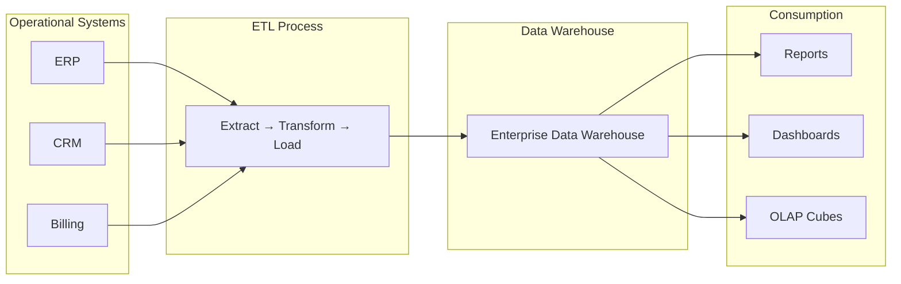
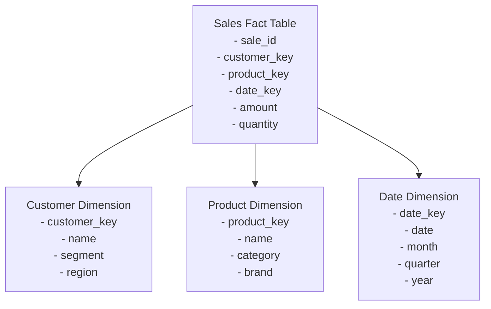
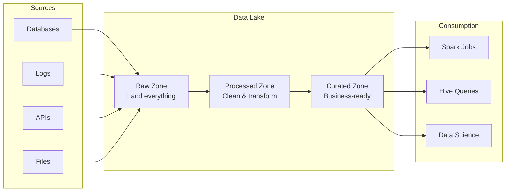
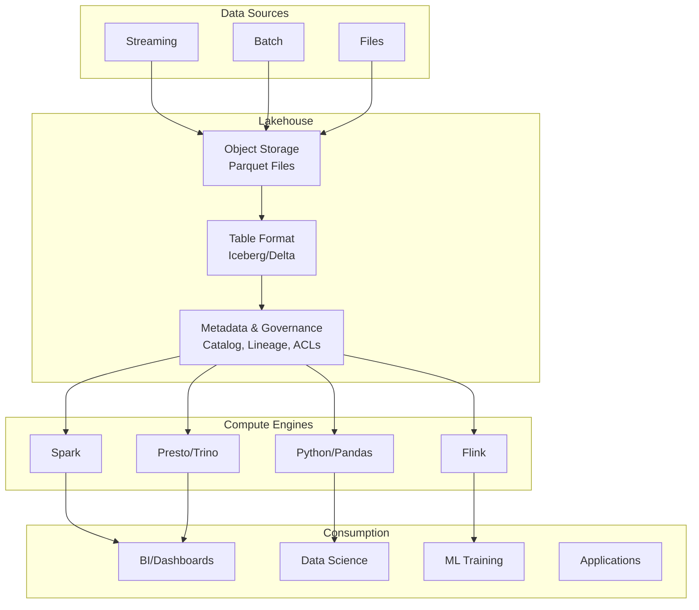

# The Evolution of Data Architectures

In 1988, Barry Devlin and Paul Murphy at IBM coined the term "data warehouse" to describe a subject-oriented, integrated, time-variant, non-volatile collection of data in support of management's decision-making process. This dry definition launched a multi-billion dollar industry and shaped how organizations thought about analytical data for two decades.

Then, around 2010, the industry declared data warehouses obsolete. The future was "data lakes"—store everything in cheap distributed storage, figure out the schema later. A decade after that, data lakes were themselves declared failures, replaced by a new architecture: the "lakehouse."

This chapter traces this evolution not as a chronological narrative but as a logical progression driven by changing constraints. Each architecture was a rational response to the limitations of its predecessor. Understanding why each emerged—and what problems it solved and created—gives you the mental model to evaluate any data architecture, including those yet to be invented.

## The Data Warehouse Era (1990-2010)

### The Problem: Siloed Operational Data

Before data warehouses, organizations had a problem: data lived in operational systems—ERP, CRM, billing, inventory—each optimized for its specific transactional workload. Analysts who needed to answer questions spanning multiple systems had few options:

1. **Run reports directly on operational databases**, risking performance impact and getting inconsistent snapshots as data changed mid-report
2. **Build point-to-point integrations** between systems, creating a spider web of dependencies that was fragile and unmaintainable
3. **Export data to spreadsheets** and reconcile manually, with obvious accuracy and scalability problems

None of these options worked at enterprise scale. Organizations needed a dedicated environment for analytical workloads, separate from operational systems.

### The Solution: A Separate Analytical Database

The data warehouse architecture addressed this by creating a purpose-built environment for analytics:



Key characteristics:

**Subject-oriented**: Data was organized around business concepts (customers, products, sales) rather than operational processes.

**Integrated**: Data from multiple sources was conformed to common definitions. "Customer" meant the same thing regardless of which source system the data came from.

**Time-variant**: The warehouse maintained historical data, enabling trend analysis and point-in-time reporting.

**Non-volatile**: Once loaded, data wasn't updated—new records were appended. This made reporting stable and reproducible.

### Dimensional Modeling

The dominant approach to warehouse design was **dimensional modeling**, pioneered by Ralph Kimball. At its core, dimensional modeling organizes data into two types of tables:

**Fact tables** contain measurements—the numeric values you want to analyze (sales amount, quantity, duration). Each row represents an event or transaction.

**Dimension tables** contain descriptive attributes—the context for facts (customer name, product category, date). They answer "who, what, when, where, why."

The canonical structure is the **star schema**:



This design optimizes for analytical queries: joining a fact table to dimension tables on surrogate keys is efficient, and dimensional attributes enable flexible slicing and dicing.

We'll cover dimensional modeling in detail in Chapter 13, but the key insight here is that data warehouses imposed structure upfront. You couldn't just load raw data; you had to model it first.

### The ETL Process

Data moved from operational systems to the warehouse through **ETL: Extract, Transform, Load**.

**Extract**: Pull data from source systems, typically through database queries, file exports, or later, change data capture.

**Transform**: Clean, conform, and restructure data to match the warehouse schema. This is where business logic was applied—deduplication, data type conversion, surrogate key generation, dimensional conformance.

**Load**: Insert transformed data into the warehouse tables, respecting the dimensional model.

ETL was typically scheduled as overnight batch jobs. Analysts arrived in the morning to find yesterday's data loaded and ready for queries.

### What Worked

Data warehouses delivered real value:

**Consistent definitions**: When everyone queries the same "customer" dimension, debates about metrics become productive rather than definitional.

**Historical analysis**: The time-variant nature enabled trend analysis that operational systems couldn't support.

**Query performance**: Warehouses were optimized for analytical queries—column indexes, materialized views, OLAP cubes for complex aggregations.

**Governance**: Centralized data meant centralized governance. Data stewards could enforce quality standards and access controls.

**Self-service BI**: Business users could build reports and dashboards against a stable, documented data model without involving engineers for every request.

### What Failed

By the late 2000s, the limitations were becoming painful:

**Cost**: Enterprise data warehouses (Teradata, Netezza, Oracle) were expensive—millions of dollars in licensing plus specialized hardware. Storage costs were particularly punishing.

**Schema rigidity**: Changing the dimensional model required significant effort. Adding a new source or attribute meant coordinating schema changes, ETL modifications, and downstream report updates. Organizations couldn't move fast.

**Limited data types**: Warehouses excelled at structured, relational data. Semi-structured data (JSON, XML) and unstructured data (logs, documents, images) didn't fit the model.

**Scale ceilings**: When data volumes exceeded what a single warehouse could handle, options were limited and expensive. Scaling required buying bigger hardware (scale-up) rather than adding commodity machines (scale-out).

**ETL brittleness**: As source systems evolved, ETL jobs frequently broke. The tight coupling between source schemas and warehouse models created maintenance burden.

**Speed-of-thought analysis**: The overnight batch loading meant analysts were always working with yesterday's data. For some use cases, this was unacceptable.

### The Vendor Landscape

The data warehouse era was dominated by:

- **Teradata**: The enterprise standard, known for performance but notorious for cost
- **Oracle**: Combined operational and analytical workloads, but not optimized for either
- **IBM Netezza**: Appliance-based approach with integrated hardware and software
- **Microsoft SQL Server**: Enterprise warehouse capabilities at lower cost than competitors

These were all **scale-up** architectures: when you needed more capacity, you bought bigger machines. This worked until it didn't.

## The Big Data Revolution and Data Lakes (2010-2018)

### The Problem: Volume, Variety, and Velocity

Three forces converged to break the data warehouse model:

**Volume**: Internet-scale companies generated data volumes that traditional warehouses couldn't handle economically. Google processed 20 petabytes per day in 2008. No Teradata installation could touch that.

**Variety**: Clickstreams, logs, sensor data, social media, and other semi-structured sources didn't fit relational schemas. Forcing JSON into tables was awkward and lossy.

**Velocity**: Real-time applications needed data faster than overnight batch loading could provide. Ad targeting, fraud detection, and recommendations couldn't wait until tomorrow.

The data warehouse model—expensive, rigid, centralized—couldn't address these challenges.

### The Hadoop Ecosystem

Google published two papers that changed everything: the Google File System (2003) and MapReduce (2004). These described how Google processed massive datasets using clusters of commodity hardware.

The open-source community implemented these ideas as **Hadoop**:

**HDFS (Hadoop Distributed File System)**: A distributed file system that spread data across many machines with automatic replication for fault tolerance. Storage became cheap—commodity disks instead of enterprise SANs.

**MapReduce**: A programming model for processing data in parallel across the cluster. Complex transformations could be expressed as map (transform each record) and reduce (aggregate results) operations.

The economic argument was compelling: instead of a $5 million Teradata appliance, you could build a Hadoop cluster from $50,000 worth of commodity servers—and add more servers as data grew.

### The Data Lake Concept

The **data lake** emerged as the architectural pattern for Hadoop-based analytics:



The philosophy differed fundamentally from data warehouses:

**Schema-on-read vs. schema-on-write**: Data warehouses required defining the schema before loading data (schema-on-write). Data lakes stored raw data first and applied structure when reading (schema-on-read). This meant you could store data without knowing how it would be used.

**Store everything**: With cheap storage, the strategy was to capture all data, even if you didn't have immediate use for it. "You might need it later" replaced "model before you load."

**Multiple compute engines**: The same data could be processed by different tools—batch processing with Spark, SQL queries with Hive, machine learning with custom code.

### Apache Hive: SQL on Hadoop

Most analysts couldn't write MapReduce jobs. **Apache Hive** bridged this gap by providing a SQL interface over HDFS files:

```sql
-- Hive translates SQL to MapReduce/Spark jobs
SELECT customer_id, SUM(amount)
FROM transactions
WHERE date >= '2015-01-01'
GROUP BY customer_id;
```

Hive introduced the **metastore**—a central catalog tracking table definitions, schemas, and file locations. This brought some structure to the chaos of files in HDFS.

Hive also defined partitioning conventions. Tables were organized into directories by partition columns:

```
/data/transactions/year=2015/month=01/data.parquet
/data/transactions/year=2015/month=02/data.parquet
```

Queries filtering on partition columns could skip irrelevant directories entirely, dramatically improving performance.

### What Worked

The data lake approach delivered on its promises:

**Scale**: Hadoop clusters could scale to petabytes by adding commodity servers. Linear scaling replaced the exponential cost curves of traditional warehouses.

**Cost**: Storage costs dropped by 90% or more compared to enterprise warehouses. Storing a petabyte on HDFS cost tens of thousands of dollars, not millions.

**Flexibility**: Any data format could be stored—JSON, Avro, Parquet, raw text. No upfront schema design required.

**Polyglot processing**: The same data could be processed by Spark, Presto, Hive, or custom applications. You weren't locked into one query engine.

**Machine learning**: Data scientists could access raw data for feature engineering instead of being limited to pre-modeled warehouse dimensions.

### What Failed

By the mid-2010s, the data lake's problems were undeniable:

**Data swamps**: Without governance, data lakes became dumping grounds. Data was stored but undocumented, quality was unknown, ownership was unclear. "Store everything" became "find nothing."

**No ACID transactions**: HDFS was a file system, not a database. There was no atomicity (partial writes visible), no consistency (concurrent reads and writes could conflict), no isolation (readers saw in-progress writes). Pipelines had to implement workarounds for basic reliability.

**Schema chaos**: Schema-on-read meant schemas weren't enforced. The same logical table might have different schemas across different files. A query that worked last week might fail today because someone changed the data format.

**Update and delete pain**: Modifying existing records was nearly impossible. To update a row, you had to rewrite the entire file (or partition) containing it. GDPR's "right to erasure" became a nightmare.

**Query performance**: While Hive made SQL possible, it wasn't fast. Queries that took seconds on a data warehouse took minutes or hours on Hive. Performance tuning required deep expertise.

**Operational complexity**: Running a Hadoop cluster required specialized skills. Capacity planning, YARN configuration, HDFS maintenance, and job tuning consumed significant engineering resources.

### The Data Warehouse Strikes Back

The data lake's failures coincided with a new generation of cloud data warehouses:

**Amazon Redshift (2012)**: A managed, columnar data warehouse in AWS. Pay-per-use pricing eliminated upfront capital costs.

**Google BigQuery (2011)**: Serverless analytics with automatic scaling. Charged per query, not per cluster.

**Snowflake (2014)**: Separated compute from storage, enabling independent scaling. Multi-cluster shared data eliminated resource contention.

These cloud warehouses offered:
- **Warehouse performance** with familiar SQL semantics
- **Cloud economics**: pay-as-you-go, scale on demand
- **Managed operations**: no clusters to maintain

Many organizations "gave up" on data lakes and moved data back to warehouses—often both raw data (stored in cloud object storage) and processed data (in the cloud warehouse).

But this created new problems: data duplication, multiple sources of truth, complex pipelines to keep warehouse and lake synchronized.

## The Lakehouse Architecture (2018-Present)

### The Problem: Two Copies of Everything

By the late 2010s, organizations often ran both architectures:

- A **data lake** on object storage (S3, GCS, ADLS) for raw data, data science, and machine learning
- A **data warehouse** (Snowflake, Redshift, BigQuery) for SQL analytics and BI

This created:
- **Data duplication**: The same data stored twice, at twice the cost
- **Synchronization complexity**: Pipelines to keep warehouse and lake in sync
- **Governance fragmentation**: Different access controls, lineage, and quality rules in each system
- **Latency**: Data had to flow through both systems before being usable

The question became: could we get warehouse reliability on lake storage?

### The Innovation: Table Formats

The lakehouse architecture emerged from a key innovation: **open table formats** that add database-like capabilities to files in object storage.

Three formats now compete:

**Delta Lake** (Databricks, 2019): Introduced ACID transactions to Spark data lakes. Used a JSON-based transaction log to track changes atomically.

**Apache Iceberg** (Netflix, 2018, open-sourced 2018): Designed for petabyte-scale tables with sophisticated metadata management. Used a hierarchy of metadata files for efficient query planning.

**Apache Hudi** (Uber, 2016, open-sourced 2019): Focused on incremental data processing with efficient upserts and deletes.

These formats share a common approach: store data in open file formats (Parquet) on object storage, but add a metadata layer that provides:

- **ACID transactions**: Atomic commits, consistent reads, isolated writes
- **Schema enforcement and evolution**: Define schemas, handle changes gracefully
- **Time travel**: Query data as it existed at past points in time
- **Efficient updates**: Modify specific records without rewriting entire tables

Chapter 5 covers table formats in depth. The key insight here is architectural: these formats enable warehouse-like reliability on lake-like storage.

### The Lakehouse Vision

The **lakehouse** combines the best of both architectures:



Key properties:

**Single copy of data**: Data lives in one place (object storage) in open formats. No duplication between lake and warehouse.

**Open formats**: Parquet files can be read by any engine. You're not locked into a proprietary format.

**Multiple compute engines**: SQL queries via Trino/Spark SQL, data science via Spark/Python, streaming via Flink—all reading the same tables.

**ACID reliability**: Table formats provide transactional guarantees that raw files couldn't.

**Warehouse-class performance**: With metadata management, query planning is efficient. Performance approaches traditional warehouses for many workloads.

**Lake-class economics**: Object storage costs ($0.02/GB/month) are orders of magnitude cheaper than warehouse storage ($10-40/GB/month).

### Medallion Architecture

A common lakehouse pattern is the **medallion architecture** (bronze/silver/gold):

**Bronze layer**: Raw data as ingested from sources. Minimal transformation—just land it. This preserves the original data for reprocessing and debugging.

**Silver layer**: Cleaned, conformed, and deduplicated data. Quality rules applied, schemas enforced, entities resolved. This is the "source of truth."

**Gold layer**: Business-level aggregates and data products. Pre-computed metrics, curated datasets for specific use cases. Optimized for query performance.

```
bronze/
  transactions/          # Raw event data

silver/
  transactions_clean/    # Deduplicated, validated
  customers/             # Resolved customer entities

gold/
  daily_sales/           # Pre-aggregated metrics
  customer_360/          # Business-ready customer view
```

This pattern provides:
- **Reprocessability**: If transformation logic changes, reprocess from bronze
- **Data quality isolation**: Problems are caught at silver before reaching gold
- **Performance optimization**: Gold tables are tuned for specific query patterns

### What's Working

The lakehouse architecture is proving out several promises:

**Cost reduction**: Organizations report 50-90% storage cost savings compared to keeping data in warehouses.

**Unified governance**: A single catalog, single set of access controls, single lineage graph.

**ML/AI integration**: Data science workloads access the same data as BI, without ETL to move data between systems.

**Open ecosystem**: Multiple vendors compete on compute, all reading the same table formats.

### What's Still Evolving

The lakehouse architecture is young, and several areas remain unsettled:

**Performance for BI workloads**: Pure lakehouse performance doesn't yet match optimized warehouses for complex BI queries. Many organizations still use Snowflake/BigQuery for performance-critical dashboards.

**Real-time capabilities**: While streaming ingestion is possible, sub-second query latency on fresh data remains challenging.

**Operational complexity**: Running Spark clusters and managing table metadata requires expertise. Managed services help but add cost.

**Format wars**: Iceberg, Delta, and Hudi are competing standards. Interoperability is improving (Delta's UniForm, Iceberg's compatibility layers) but the market hasn't converged.

**Catalog and governance**: Unity Catalog, AWS Glue Catalog, Hive Metastore, Polaris—the catalog layer is fragmented.

## Comparing the Architectures

### When Data Warehouses Still Make Sense

Despite the lakehouse momentum, data warehouses remain appropriate when:

- **Your data fits comfortably**: If your data is measured in terabytes, not petabytes, warehouse economics may be acceptable
- **You need peak SQL performance**: For complex BI workloads with demanding latency requirements
- **You value operational simplicity**: Managed warehouses are easier to run than lakehouse infrastructure
- **Your team knows SQL, not Spark**: The skills required differ significantly
- **Structured data dominates**: If you primarily work with relational data from operational systems

### When Data Lakes (Without Table Formats) Make Sense

Raw data lakes without table format structure are still appropriate when:

- **Data is truly unstructured**: Images, video, audio, or documents that won't be queried with SQL
- **You're exploring unknown data**: When you genuinely don't know how data will be used
- **Archival storage**: Long-term retention where you're optimizing for cost, not access
- **Ingestion staging**: Landing zone before any processing

### When Lakehouses Make Sense

The lakehouse architecture fits when:

- **You have diverse workloads**: SQL analytics, data science, and ML on the same data
- **Data scale is significant**: Petabyte-scale makes warehouse storage costs prohibitive
- **You need flexibility**: Evolving schemas, varied file formats, multiple compute engines
- **Open standards matter**: Avoiding vendor lock-in is a strategic priority
- **You can invest in expertise**: The architecture requires Spark/table format knowledge

### Decision Framework

```
START: What's your data scale?

├─ < 10 TB, structured data
│   └─ Cloud Data Warehouse (Snowflake, BigQuery, Redshift)
│       - Simplest to operate
│       - Best SQL performance
│       - Economics are acceptable at this scale
│
├─ 10 TB - 1 PB, mixed workloads
│   └─ Consider both:
│       - Warehouse for BI if performance is critical
│       - Lakehouse for data science and ML
│       - Or: all-in on lakehouse if team has expertise
│
└─ > 1 PB, or strong cost/openness requirements
    └─ Lakehouse
        - Storage economics are compelling
        - Table formats provide needed reliability
        - Accept query performance tradeoffs for some workloads
```

## The Future Direction

Several trends are shaping where data architectures go next:

### Convergence

The distinction between "warehouse" and "lakehouse" is blurring:

- **Snowflake** now supports Iceberg tables natively
- **Databricks** (lakehouse pioneer) acquired a BI company and is pushing toward warehouse-class SQL performance
- **BigQuery** supports external tables on GCS with BigLake

We're heading toward a world where the underlying storage format (Iceberg, Delta) is standardized, and vendors compete on query engines, governance, and ease of use.

### Real-Time Lakehouses

Streaming-first architectures are emerging:

- Write data as streams into lakehouse tables
- Query engines handle both batch and streaming with unified semantics
- Sub-minute latency becomes achievable

Apache Kafka + Apache Flink + Iceberg is a common stack for this pattern.

### AI/ML Integration

As machine learning becomes ubiquitous:

- Feature stores integrate with lakehouse tables
- Training pipelines read directly from curated data products
- Model serving accesses the same data as dashboards

The lakehouse becomes the foundation for the entire data and AI platform.

### Semantic Layers and Metrics Stores

Above the storage layer, semantic layers define business metrics:

- **dbt Semantic Layer**, **Cube**, **Metriql**: Define metrics once, query from any tool
- Consistent definitions across BI tools, notebooks, and applications
- The "metrics store" becomes a distinct architectural component

## Case Study: Evolution of a Trading Platform's Data Architecture

Let's trace how a hypothetical trading firm's data architecture might evolve:

### 2010: Data Warehouse Era

The firm runs Teradata for analytics:
- Trade data loaded overnight from the trading database
- Dimensional model: trades fact table, trader/instrument/time dimensions
- Analysts query via SQL for daily P&L reports
- Capacity: 50 TB, cost: $3M/year in licensing

**Problems emerging**: Can't handle tick data volume. Schema changes take months. No support for unstructured market data.

### 2014: Data Lake Addition

The firm adds a Hadoop cluster:
- Tick data streams into HDFS
- Data scientists build ML models for trade execution optimization
- Raw data retained for compliance (regulators might ask questions)
- Teradata remains for BI—data copied from Hadoop nightly

**Problems emerging**: Data governance is bifurcated. Two copies of everything. Hadoop is expensive to operate.

### 2018: Cloud Migration

The firm migrates to cloud:
- Teradata replaced by Snowflake
- Hadoop replaced by S3 + EMR Spark
- Faster, cheaper, but still two systems

**Problems emerging**: Still duplicating data. ML training needs data that BI has transformed.

### 2022: Lakehouse Consolidation

The firm adopts lakehouse architecture:
- All data on S3 in Iceberg tables
- Bronze/silver/gold layers with clear data products
- Snowflake connects to Iceberg tables for BI (via external tables)
- Spark processes silver → gold transformations
- ML pipelines read silver/gold tables directly

**Results**: 70% reduction in storage costs. Single governance layer. Faster time from raw data to ML features.

### 2025: Real-Time Lakehouse

The firm adopts streaming-first:
- Trade events stream via Kafka → Flink → Iceberg
- Real-time positions available in seconds, not overnight
- Same tables serve batch BI and real-time dashboards
- Feature serving for ML inference integrated with lakehouse

## Summary

This chapter traced the evolution of data architectures:

**Data Warehouses (1990-2010)**:
- Solved: Siloed data, inconsistent definitions, lack of historical analysis
- Created: Cost, rigidity, scale ceilings, limited data types
- Legacy: Dimensional modeling concepts remain foundational

**Data Lakes (2010-2018)**:
- Solved: Scale, cost, data variety, flexibility
- Created: Data swamps, no ACID, schema chaos, update problems
- Legacy: Object storage as default, schema-on-read for exploration

**Lakehouses (2018-present)**:
- Solving: Unifying lake economics with warehouse reliability
- Creating: New operational complexity, evolving standards
- Future: Convergence, real-time, AI integration

**Key insight**: Each architecture was a rational response to constraints of its time. Understanding these constraints lets you evaluate whether an architecture fits your situation—and anticipate what might come next.

**Looking ahead**:
- Chapter 4 explores storage fundamentals: file formats, object storage, and the building blocks of modern data platforms
- Chapter 5 dives deep into table formats: how Iceberg, Delta, and Hudi actually work
- Chapter 6 covers when to use dedicated OLAP databases alongside (or instead of) lakehouses

## Further Reading

- Kimball, R. & Ross, M. (2013). *The Data Warehouse Toolkit*, 3rd Edition — The definitive guide to dimensional modeling
- Armbrust, M. et al. (2021). "Lakehouse: A New Generation of Open Platforms that Unify Data Warehousing and Advanced Analytics" — Academic paper defining the lakehouse architecture
- Databricks Blog: "What is a Lakehouse?" — Accessible introduction: https://www.databricks.com/glossary/data-lakehouse
- Netflix Tech Blog: "Apache Iceberg at Netflix" — Real-world lakehouse implementation
