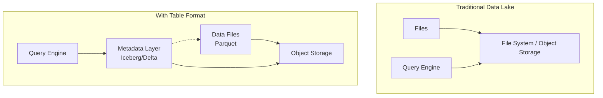

# Table Formats - The Lakehouse Foundation

In 2017, Netflix faced a problem that seemed contradictory: they needed ACID transactions on petabyte-scale tables stored in Amazon S3—but S3 is just object storage, not a database. You can't run transactions on a filesystem. Yet Netflix engineers found a way: instead of modifying the storage layer, they built a metadata layer that tracks file-level changes atomically. They called it Iceberg.

Around the same time, Databricks created Delta Lake to solve similar problems for Spark users. Uber built Hudi (Hadoop Upserts Deletes and Incrementals) for their streaming ingestion pipelines. These three projects—Apache Iceberg, Delta Lake, and Apache Hudi—represent the table format revolution that enabled the lakehouse architecture.

This chapter provides deep coverage of table formats: what problems they solve, how they work internally, when to use each, and how to choose between them. Table formats are the foundational technology that transforms object storage from a dumping ground into a reliable data platform.

## The Problem Table Formats Solve

To understand table formats, we must first understand why raw files on object storage are insufficient for serious data engineering.

### The Limitations of Files and Directories

Consider a simple analytical table stored as Parquet files in S3:

```
s3://bucket/events/
  date=2024-01-01/
    part-0001.parquet
    part-0002.parquet
  date=2024-01-02/
    part-0001.parquet
    ...
```

This structure has fundamental problems:

**No atomicity.** A job writing 100 files might fail after writing 50. Readers see a half-written, inconsistent state. There's no way to make the write "all or nothing."

**No isolation.** If a reader queries the table while a writer is adding files, the reader might see some new files but not others, producing inconsistent results.

**No schema enforcement.** Different files might have different schemas. A writer could add a file with incompatible types, breaking downstream queries.

**Expensive metadata operations.** To read the table, a query engine must LIST all directories and files—thousands of API calls for large tables. S3 LIST operations are slow (1,000 objects per request) and expensive.

**No time travel.** Once you overwrite or delete files, previous versions are gone. You can't query "what the data looked like last Tuesday."

**Painful updates and deletes.** To delete a single row, you must rewrite the entire file containing it. To update rows, same problem. GDPR compliance becomes a nightmare.

**No concurrent writes.** Two jobs writing to the same partition can corrupt data. There's no coordination mechanism.

These aren't minor inconveniences—they're fundamental gaps that prevent building reliable data platforms on raw files.

### What Table Formats Provide

Table formats add a **metadata layer** that tracks:

- **Which files belong to the table** (no directory listing needed)
- **The schema** (enforced on write)
- **Partition information** (for efficient queries)
- **Column-level statistics** (for predicate pushdown)
- **Transaction history** (for atomicity, isolation, and time travel)

This metadata layer transforms files on object storage into something that behaves like a database table—with ACID transactions, schema evolution, and efficient queries.



## Apache Iceberg Deep Dive

Apache Iceberg emerged from Netflix's need to manage petabyte-scale tables reliably. It's designed with several guiding principles: correctness at any scale, engine independence, and avoiding vendor lock-in.

### Architecture Overview

Iceberg's architecture has three layers:

```
┌─────────────────────────────────────────────────────────┐
│                    Catalog                               │
│  (Tracks current metadata location for each table)       │
├─────────────────────────────────────────────────────────┤
│                Metadata Layer                            │
│  ┌─────────────────────────────────────────────────────┐ │
│  │              Metadata File                           │ │
│  │  - Current snapshot pointer                          │ │
│  │  - Schema history                                    │ │
│  │  - Partition spec history                            │ │
│  │  - Table properties                                  │ │
│  └───────────────────┬─────────────────────────────────┘ │
│                      │                                   │
│  ┌───────────────────▼─────────────────────────────────┐ │
│  │            Snapshot                                  │ │
│  │  - Snapshot ID                                       │ │
│  │  - Timestamp                                         │ │
│  │  - Manifest list pointer                             │ │
│  └───────────────────┬─────────────────────────────────┘ │
│                      │                                   │
│  ┌───────────────────▼─────────────────────────────────┐ │
│  │          Manifest List                               │ │
│  │  - List of manifest file locations                   │ │
│  │  - Partition range summaries                         │ │
│  └───────────────────┬─────────────────────────────────┘ │
│                      │                                   │
│  ┌───────────────────▼─────────────────────────────────┐ │
│  │          Manifest Files                              │ │
│  │  - File paths                                        │ │
│  │  - Partition values                                  │ │
│  │  - Column statistics (min/max/null count)            │ │
│  │  - File size, row count                              │ │
│  └─────────────────────────────────────────────────────┘ │
├─────────────────────────────────────────────────────────┤
│                  Data Layer                              │
│  ┌─────────────────────────────────────────────────────┐ │
│  │              Data Files                              │ │
│  │  - Parquet, ORC, or Avro files                       │ │
│  │  - Stored in object storage                          │ │
│  └─────────────────────────────────────────────────────┘ │
└─────────────────────────────────────────────────────────┘
```

**Catalog:** The entry point. Stores the current metadata file location for each table. Can be Hive Metastore, AWS Glue, Nessie, or Iceberg's REST Catalog.

**Metadata file:** JSON (or Avro in older versions) containing:
- Current schema and schema history
- Partition spec and its history
- Current snapshot pointer
- Table properties

**Snapshot:** Represents the table state at a point in time. Contains a pointer to a manifest list.

**Manifest list:** An Avro file listing all manifest files for a snapshot, with partition range summaries for efficient pruning.

**Manifest files:** Avro files listing data files with detailed metadata—paths, partition values, column statistics, row counts.

**Data files:** The actual Parquet (or ORC/Avro) files containing table data.

### How Reads Work

When a query reads an Iceberg table:

1. **Consult catalog:** Get current metadata file location
2. **Read metadata file:** Get current snapshot, schema, partition spec
3. **Read manifest list:** Get list of manifest files with partition summaries
4. **Prune manifest files:** Skip manifests whose partition ranges don't match the query
5. **Read relevant manifests:** Get data file list with statistics
6. **Prune data files:** Skip files whose statistics don't match predicates
7. **Read data files:** Read only the necessary files

This hierarchical pruning is why Iceberg performs well at scale. A query on a petabyte table might read only megabytes of metadata before touching any data.

### How Writes Work

When a job writes to an Iceberg table:

1. **Write data files:** Write new Parquet files to object storage
2. **Create new manifest:** List the new files with their statistics
3. **Create new manifest list:** Reference existing manifests plus the new one
4. **Create new snapshot:** Point to the new manifest list
5. **Update metadata file:** Point to the new snapshot
6. **Atomic catalog update:** Update the catalog to point to new metadata

The key insight: **only the catalog update is atomic**. Everything else can be written speculatively. If the catalog update fails (because another writer committed first), the speculative files are orphaned and cleaned up later.

### ACID Transactions

Iceberg provides ACID guarantees through **optimistic concurrency control**:

**Atomicity:** Each commit creates a new snapshot atomically. Either all changes are visible or none are.

**Consistency:** Schema validation happens at write time. Invalid data is rejected.

**Isolation:** Readers see a consistent snapshot. Writers work on their own copy of metadata. Conflicts are detected at commit time.

**Durability:** Once the catalog is updated, the transaction is durable (assuming object storage durability).

**Conflict resolution:** When two writers commit concurrently:
1. Both write their data files and metadata speculatively
2. One succeeds in updating the catalog
3. The other detects the conflict and retries (re-reading current state, checking for conflicts, updating metadata to include both changes)

### Schema Evolution

Iceberg tracks schema changes as part of table history:

```
Schema v1: {id: int, name: string}
Schema v2: {id: int, name: string, email: string}  -- added email
Schema v3: {id: int, name: string, email: string, age: int}  -- added age
```

**Adding columns:** New columns have null values in existing files. No data rewrite needed.

**Dropping columns:** Column is removed from schema. Existing files still have the data; it's just not read.

**Renaming columns:** Iceberg uses unique column IDs internally, so renames don't affect data files.

**Widening types:** int → long, float → double are safe. Iceberg tracks type changes.

**Reordering columns:** Supported without data rewrite (column IDs are stable).

The V3 specification (released 2025) adds **default values**: when adding a column, you can specify a default value that applies to existing data without rewriting files.

### Partition Evolution

A killer feature of Iceberg: changing partitioning without rewriting data.

Traditional Hive-style partitioning embeds partition values in file paths:
```
s3://bucket/table/year=2024/month=01/file.parquet
```

Changing the partition scheme requires rewriting all files. Iceberg stores partition information in metadata, not paths:

```
# Original partition spec
PARTITIONED BY (month(event_time))

# Later, change to daily
PARTITIONED BY (day(event_time))
```

New data uses the new scheme. Old data keeps its old scheme. Iceberg tracks which partition spec applies to which files. Queries work seamlessly across both.

### Hidden Partitioning

Iceberg partitions are **hidden** from users. Instead of requiring users to specify partition columns in queries:

```sql
-- Hive: Users must know the partition scheme
SELECT * FROM events WHERE year = 2024 AND month = 01 AND day = 15;

-- Iceberg: Just filter on the column
SELECT * FROM events WHERE event_time = '2024-01-15';
```

Iceberg automatically derives partition values from source columns using transforms:
- `year(timestamp)`, `month(timestamp)`, `day(timestamp)`, `hour(timestamp)`
- `bucket(N, column)` for hash partitioning
- `truncate(width, column)` for prefix partitioning

This prevents a common error: queries that filter on source columns but don't align with partitions, causing full table scans.

### Time Travel

Every Iceberg commit creates a snapshot. You can query any historical snapshot:

```sql
-- Query current state
SELECT * FROM events;

-- Query as of specific snapshot ID
SELECT * FROM events VERSION AS OF 12345;

-- Query as of timestamp
SELECT * FROM events TIMESTAMP AS OF '2024-01-15 10:00:00';
```

Time travel enables:
- **Debugging:** "What did the data look like when the report was wrong?"
- **Reproducibility:** "Run the same ML training on last month's data"
- **Auditing:** "What was our position at market close?"
- **Rollback:** Restore a previous snapshot if a bad write corrupted data

### V3 Specification Features (2025)

The Iceberg V3 spec, matured through 2025 releases (1.8.0 through 1.10.x), introduces:

**Deletion vectors (DVs):** Instead of rewriting files to delete rows, store a bitmap indicating which rows are deleted. Dramatically faster deletes for small deletions.

**Variant type:** Native support for semi-structured JSON-like data. Enables flexible schemas without sacrificing performance.

**Default column values:** Add columns with default values that apply to existing data without rewriting files.

**Row lineage:** Fine-grained traceability for individual rows—track where each row came from.

### Iceberg Ecosystem

Iceberg is designed for multi-engine environments:

**Compute engines:** Spark, Trino/Presto, Flink, Dremio, Athena, Starburst, Impala
**Catalogs:** Hive Metastore, AWS Glue, Nessie, Polaris, REST Catalog
**Cloud support:** AWS, GCP, Azure all provide Iceberg support

The REST Catalog standard enables any engine to work with any catalog through a standardized API.

## Delta Lake Deep Dive

Delta Lake was created by Databricks to bring reliability to data lakes built on Apache Spark. It's deeply integrated with Spark and the Databricks platform.

### Architecture Overview

Delta Lake uses a simpler architecture than Iceberg, centered on a **transaction log**:

```
table/
├── _delta_log/
│   ├── 00000000000000000000.json    # Transaction 0
│   ├── 00000000000000000001.json    # Transaction 1
│   ├── 00000000000000000002.json    # Transaction 2
│   ├── ...
│   ├── 00000000000000000010.checkpoint.parquet  # Checkpoint
│   └── _last_checkpoint                         # Checkpoint pointer
├── part-00000-xxx.parquet           # Data files
├── part-00001-xxx.parquet
└── ...
```

**Transaction log:** A sequence of JSON files recording every change to the table. Each file contains actions like:
- `add`: A new data file was added
- `remove`: A data file was removed (but still physically present)
- `metadata`: Schema or properties changed
- `protocol`: Table format version changed

**Checkpoints:** Periodically, Delta Lake writes a Parquet checkpoint summarizing the current state. This avoids reading thousands of small JSON files.

### How Transactions Work

Each write creates a new transaction log entry:

1. **Read current state:** Load checkpoint + subsequent log files
2. **Write data files:** Write new Parquet files
3. **Write log entry:** Atomically write the next JSON log file
4. **Object storage atomicity:** The log file write is atomic (put-if-absent semantics)

The key insight: Delta Lake relies on **object storage conditional writes** for atomicity. S3, GCS, and ADLS support put-if-absent, which Delta uses to ensure only one writer can create a given log file number.

### Conflict Resolution

When two writers race:

1. Writer A reads state at version 10
2. Writer B reads state at version 10
3. Writer A writes `00000000000000000011.json` (succeeds)
4. Writer B tries to write `00000000000000000011.json` (fails—file exists)
5. Writer B retries: reads version 11, checks for conflicts, writes version 12

This is optimistic concurrency control, similar to Iceberg but implemented via filesystem operations rather than catalog operations.

### Liquid Clustering

Traditional partitioning and Z-ordering have limitations:
- **Partitioning:** Can't change without rewriting data
- **Z-ordering:** Must be rerun from scratch; doesn't handle incremental data

**Liquid clustering** (introduced in Delta Lake 3.0, GA in 2024) solves these:

```sql
CREATE TABLE events
CLUSTER BY (event_type, event_date)
USING DELTA;
```

**Key benefits:**
- **Incremental:** Only new/modified data is re-clustered
- **Adaptive:** Clustering improves over time as data is compacted
- **Flexible:** Change clustering columns without rewriting historical data
- **Automatic:** Clustering happens as part of optimization, not a separate job

Liquid clustering uses **Hilbert curves** (a space-filling curve that preserves locality better than Z-order) for multi-dimensional clustering.

### UniForm: Universal Format

Delta Lake 3.0 introduced **UniForm**—automatic generation of Iceberg and Hudi metadata alongside Delta metadata:

```sql
ALTER TABLE events SET TBLPROPERTIES (
  'delta.universalFormat.enabledFormats' = 'iceberg,hudi'
);
```

With UniForm enabled:
- Data files are shared (same Parquet files)
- Delta writes its transaction log
- Delta also writes Iceberg metadata files
- Delta also writes Hudi metadata

**Why it matters:** You can write data with Spark/Delta and read it with Trino/Iceberg or any Hudi-compatible engine. One write, multiple read paths.

**Limitations:** UniForm generates read-only metadata for other formats. You can't write via Iceberg and have Delta see it.

### Delta Lake 4.0 Features (2025)

The latest Delta Lake 4.0 release adds:

**Enhanced catalog integration:** Better support for external catalogs beyond Hive Metastore

**Improved statistics:** More granular file statistics for better query optimization

**Spark 4.0 compatibility:** Full support for the latest Spark release

**Clustered tables in Kernel:** Delta Kernel (the standalone Delta reader/writer library) now supports liquid clustering

## Apache Hudi

Apache Hudi (Hadoop Upserts Deletes and Incrementals) was created at Uber for managing streaming data ingestion with efficient record-level updates.

### Core Concepts

Hudi organizes data into two table types:

**Copy-on-Write (CoW):** Updates rewrite entire files. Best for read-heavy workloads.

**Merge-on-Read (MoR):** Updates write to delta logs; reads merge at query time. Best for write-heavy workloads.

```
# Copy-on-Write: Updates rewrite files
Before: file1.parquet (rows A, B, C)
Update B → Rewrite file1.parquet (rows A, B', C)

# Merge-on-Read: Updates write delta logs
Before: file1.parquet (rows A, B, C)
Update B → Write file1.deltalog (row B')
Read → Merge file1.parquet + file1.deltalog → (rows A, B', C)
```

### Record-Level Operations

Hudi tracks individual records via **record keys**:

```sql
CREATE TABLE events (
  event_id STRING,
  event_type STRING,
  ...
) USING HUDI
OPTIONS (
  primaryKey = 'event_id',
  preCombineField = 'event_time'
);
```

The `preCombineField` handles duplicates—when two records have the same key, the one with the latest `event_time` wins.

### Incremental Processing

Hudi's strength is incremental queries:

```sql
-- Read only records changed since commit X
SELECT * FROM events
WHERE _hoodie_commit_time > 'X';
```

This enables efficient CDC (change data capture) patterns: downstream jobs process only changed records rather than full table scans.

### When to Choose Hudi

Hudi is strongest when:
- Record-level updates are frequent
- CDC/streaming ingestion is the primary pattern
- Incremental processing is critical
- You're on the Hudi ecosystem (AWS EMR has strong Hudi support)

## Comparing Table Formats

### Feature Comparison

| Feature | Iceberg | Delta Lake | Hudi |
|---------|---------|------------|------|
| **ACID transactions** | Yes | Yes | Yes |
| **Schema evolution** | Excellent | Good | Good |
| **Partition evolution** | Yes | With liquid clustering | Limited |
| **Time travel** | Yes | Yes | Yes |
| **Deletion vectors** | Yes (V3) | Yes | No (CoW/MoR instead) |
| **Multi-engine support** | Excellent | Good (UniForm helps) | Good |
| **Streaming support** | Good | Excellent | Excellent |
| **Record-level updates** | Good | Good | Excellent |
| **Incremental queries** | Limited | Limited | Excellent |
| **Governance** | Depends on catalog | Unity Catalog | Limited |
| **Primary backer** | Community (Netflix origin) | Databricks | Uber |

### Architectural Differences

**Metadata storage:**
- **Iceberg:** Hierarchical (manifest list → manifests → files). Scales to millions of files.
- **Delta:** Linear transaction log with checkpoints. Simpler but may struggle at extreme scale.
- **Hudi:** Timeline + file groups. Optimized for record-level operations.

**Atomicity mechanism:**
- **Iceberg:** Catalog atomic update
- **Delta:** Object storage conditional put
- **Hudi:** Timeline commits

**Multi-engine support:**
- **Iceberg:** Native support in most engines (Spark, Flink, Trino, Presto)
- **Delta:** Best with Spark; UniForm enables Iceberg/Hudi readers
- **Hudi:** Good support in Spark, Flink, Presto

### Decision Framework

```
START: What's your primary engine?

├─ Databricks
│   └─ Delta Lake
│       - Native integration
│       - Unity Catalog governance
│       - Liquid clustering
│       - UniForm for interoperability
│
├─ Multi-engine (Spark + Trino + Flink + ...)
│   └─ Apache Iceberg
│       - Best multi-engine support
│       - Strong community
│       - Partition evolution
│       - No vendor lock-in
│
├─ Heavy record-level updates (CDC, streaming)
│   └─ Consider Hudi
│       - Optimized for upserts
│       - Incremental processing
│       - Good streaming support
│
└─ Uncertain / greenfield
    └─ Apache Iceberg (safe default)
        - Widest ecosystem support
        - Most flexible
        - Strong momentum
```

### The Convergence Trend

The table format landscape is converging:

**Feature parity:** All three formats now support ACID, time travel, schema evolution. Differentiators are shrinking.

**Interoperability:** Delta's UniForm writes Iceberg metadata. Iceberg supports reading Delta (limited). Hudi supports Iceberg metadata generation.

**Catalog standardization:** Iceberg's REST Catalog, Unity Catalog, and AWS Glue all provide cross-format support.

**Prediction:** In 2-3 years, the format choice may matter less as interoperability improves. Choose based on ecosystem fit today, knowing you're not locked in forever.

## Practical Implementation

### Creating and Using Iceberg Tables

**Spark:**
```python
# Create table
spark.sql("""
    CREATE TABLE catalog.db.events (
        event_id STRING,
        event_type STRING,
        event_time TIMESTAMP,
        payload STRING
    )
    USING iceberg
    PARTITIONED BY (day(event_time))
""")

# Write data
df.writeTo("catalog.db.events").append()

# Read data
spark.table("catalog.db.events").filter("event_time > '2024-01-01'")

# Time travel
spark.read.option("as-of-timestamp", "2024-01-15 10:00:00") \
    .table("catalog.db.events")
```

**Trino/Presto:**
```sql
-- Query Iceberg table
SELECT * FROM iceberg.db.events
WHERE event_time > TIMESTAMP '2024-01-01';

-- Time travel
SELECT * FROM iceberg.db.events FOR TIMESTAMP AS OF
    TIMESTAMP '2024-01-15 10:00:00';
```

### Creating and Using Delta Tables

**Spark/Databricks:**
```python
# Create table
spark.sql("""
    CREATE TABLE events (
        event_id STRING,
        event_type STRING,
        event_time TIMESTAMP,
        payload STRING
    )
    USING delta
    CLUSTER BY (event_type, event_time)
""")

# Write data
df.write.format("delta").mode("append").saveAsTable("events")

# Merge (upsert)
from delta.tables import DeltaTable

delta_table = DeltaTable.forName(spark, "events")
delta_table.alias("target").merge(
    updates_df.alias("source"),
    "target.event_id = source.event_id"
).whenMatchedUpdateAll().whenNotMatchedInsertAll().execute()

# Time travel
spark.read.format("delta").option("versionAsOf", 5).table("events")
```

### Table Maintenance Operations

Both formats require maintenance for optimal performance:

**Compaction (small file consolidation):**
```python
# Iceberg
spark.sql("CALL catalog.system.rewrite_data_files(table => 'db.events')")

# Delta
spark.sql("OPTIMIZE events")
```

**Snapshot/version cleanup:**
```python
# Iceberg: Remove old snapshots
spark.sql("""
    CALL catalog.system.expire_snapshots(
        table => 'db.events',
        older_than => TIMESTAMP '2024-01-01'
    )
""")

# Delta: Remove old versions
spark.sql("VACUUM events RETAIN 168 HOURS")
```

**Orphan file cleanup:**
```python
# Iceberg
spark.sql("""
    CALL catalog.system.remove_orphan_files(
        table => 'db.events',
        older_than => TIMESTAMP '2024-01-01'
    )
""")
```

### Migration Strategies

**From Hive/raw Parquet to Iceberg:**

```python
# In-place migration (metadata only, no data copy)
spark.sql("""
    CALL catalog.system.migrate(table => 'hive_db.events')
""")

# Or with Spark: read Parquet, write Iceberg
spark.read.parquet("s3://bucket/events/") \
    .writeTo("catalog.db.events") \
    .create()
```

**From Delta to Iceberg:**

With UniForm, Delta tables can be read as Iceberg. For full migration:
```python
# Read Delta, write Iceberg
spark.read.format("delta").load("s3://bucket/delta_events/") \
    .writeTo("catalog.db.iceberg_events") \
    .create()
```

## Case Study: Trading Data on Iceberg

Let's trace how a trading firm might use Iceberg for market data:

### Requirements

- **Volume:** 500 million events/day
- **Latency:** Data available within 5 minutes of occurrence
- **Queries:** Time-range scans, aggregations by instrument
- **Updates:** Occasional corrections (T+1 reconciliation)
- **Retention:** 7 years for regulatory compliance
- **Time travel:** Query historical state for backtesting

### Architecture

```
                    ┌─────────────────┐
Exchanges ──────────▶│   Kafka         │
                    └────────┬────────┘
                             │
                    ┌────────▼────────┐
                    │   Flink Job     │
                    │ (Streaming)     │
                    └────────┬────────┘
                             │
                    ┌────────▼────────┐
                    │   Iceberg       │
                    │   (S3 + Glue)   │
                    └────────┬────────┘
                             │
        ┌────────────────────┼────────────────────┐
        │                    │                    │
┌───────▼───────┐   ┌───────▼───────┐   ┌───────▼───────┐
│   Spark       │   │   Trino       │   │   Python      │
│   (Batch)     │   │   (BI)        │   │   (ML)        │
└───────────────┘   └───────────────┘   └───────────────┘
```

### Table Design

```sql
CREATE TABLE market_data.ticks (
    -- Business columns
    symbol STRING,
    exchange STRING,
    price DECIMAL(18, 8),
    quantity DECIMAL(18, 8),
    trade_time TIMESTAMP,

    -- Metadata
    received_time TIMESTAMP,
    source_system STRING
)
USING iceberg
PARTITIONED BY (day(trade_time), bucket(16, symbol))
TBLPROPERTIES (
    'write.target-file-size-bytes' = '536870912',  -- 512 MB
    'write.parquet.compression-codec' = 'zstd'
);
```

**Partitioning rationale:**
- `day(trade_time)`: Most queries filter by date range
- `bucket(16, symbol)`: Spreads hot symbols across files; avoids skew

### Streaming Ingestion with Flink

```java
// Flink Iceberg sink
StreamExecutionEnvironment env = ...;
TableLoader tableLoader = TableLoader.fromHadoopTable("s3://bucket/market_data/ticks");

FlinkSink.forRowData(dataStream)
    .tableLoader(tableLoader)
    .hadoopConf(conf)
    .equalityFieldColumns(Arrays.asList("symbol", "trade_time"))  // For upserts
    .build();
```

### Handling Late Data and Corrections

T+1 reconciliation may correct previous day's data:

```python
# Merge corrections
spark.sql("""
    MERGE INTO market_data.ticks target
    USING corrections source
    ON target.symbol = source.symbol
       AND target.trade_time = source.trade_time
    WHEN MATCHED THEN UPDATE SET *
    WHEN NOT MATCHED THEN INSERT *
""")
```

### Time Travel for Backtesting

```python
# Query data as it existed at backtest time
# (Avoid look-ahead bias in ML training)
backtest_date = "2024-01-15 16:00:00"

historical_data = spark.read \
    .option("as-of-timestamp", backtest_date) \
    .table("market_data.ticks") \
    .filter("trade_time < '2024-01-15'")
```

### Operational Procedures

**Daily compaction:**
```python
# Run after nightly batch load
spark.sql("""
    CALL catalog.system.rewrite_data_files(
        table => 'market_data.ticks',
        where => 'trade_time >= current_date - INTERVAL 1 DAY'
    )
""")
```

**Monthly snapshot expiration:**
```python
# Keep 90 days of snapshots for time travel
spark.sql("""
    CALL catalog.system.expire_snapshots(
        table => 'market_data.ticks',
        older_than => current_timestamp - INTERVAL 90 DAYS,
        retain_last => 10
    )
""")
```

**Storage tiering:**
```python
# Move old partitions to cheaper storage
# (Using S3 lifecycle policies or explicit data movement)
```

## Summary

Table formats are the foundation of the lakehouse architecture:

**The problem they solve:**
- ACID transactions on object storage
- Schema enforcement and evolution
- Efficient metadata management
- Time travel and auditing
- Concurrent read/write safety

**Apache Iceberg:**
- Best multi-engine support
- Sophisticated metadata hierarchy
- Partition evolution
- Strong community momentum
- V3 spec adds deletion vectors, variant type

**Delta Lake:**
- Deep Spark/Databricks integration
- Transaction log architecture
- Liquid clustering for flexible data layout
- UniForm for format interoperability

**Apache Hudi:**
- Optimized for record-level updates
- Excellent incremental processing
- Strong streaming integration
- CoW/MoR table types

**Choosing a format:**
- Databricks ecosystem → Delta Lake
- Multi-engine environment → Iceberg
- Heavy upsert workloads → Consider Hudi
- Uncertain → Iceberg (safe default)

**Key insight:** The formats are converging. Choose based on ecosystem fit today, implement proper abstractions, and know that migration is possible.

**Looking ahead:**
- Chapter 6 explores when dedicated OLAP databases complement lakehouse tables
- Chapter 8 covers Spark's integration with table formats
- Chapter 15 presents complete lakehouse architecture patterns

## Further Reading

- Apache Iceberg Documentation: https://iceberg.apache.org/docs/latest/
- Delta Lake Documentation: https://docs.delta.io/
- Apache Hudi Documentation: https://hudi.apache.org/docs/overview/
- "Apache Iceberg: The Definitive Guide" (O'Reilly, 2024)
- Databricks Blog: Delta Lake technical deep dives
- Netflix Tech Blog: "Apache Iceberg at Netflix" series
