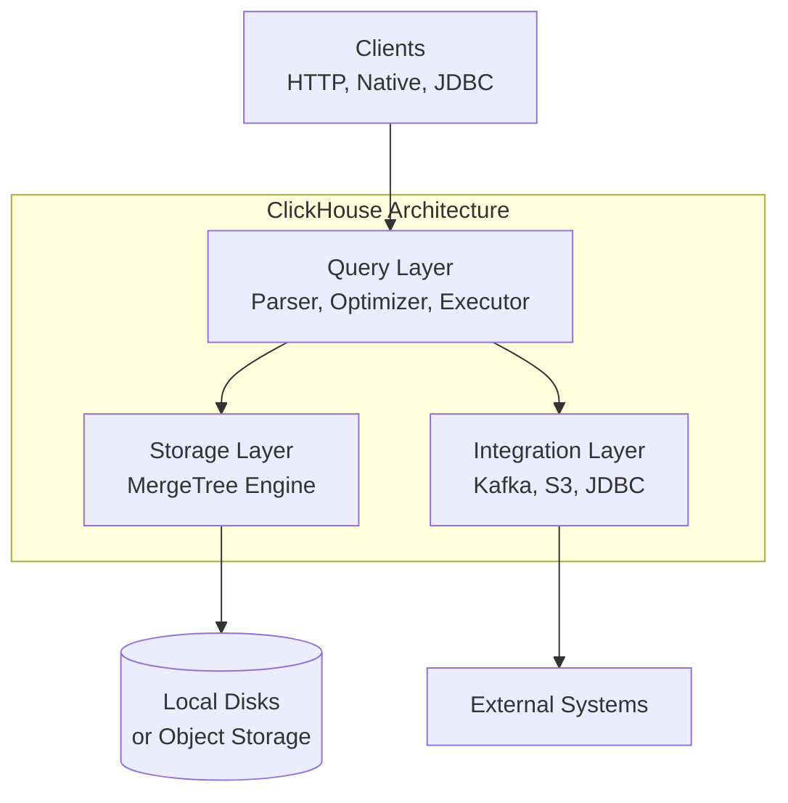
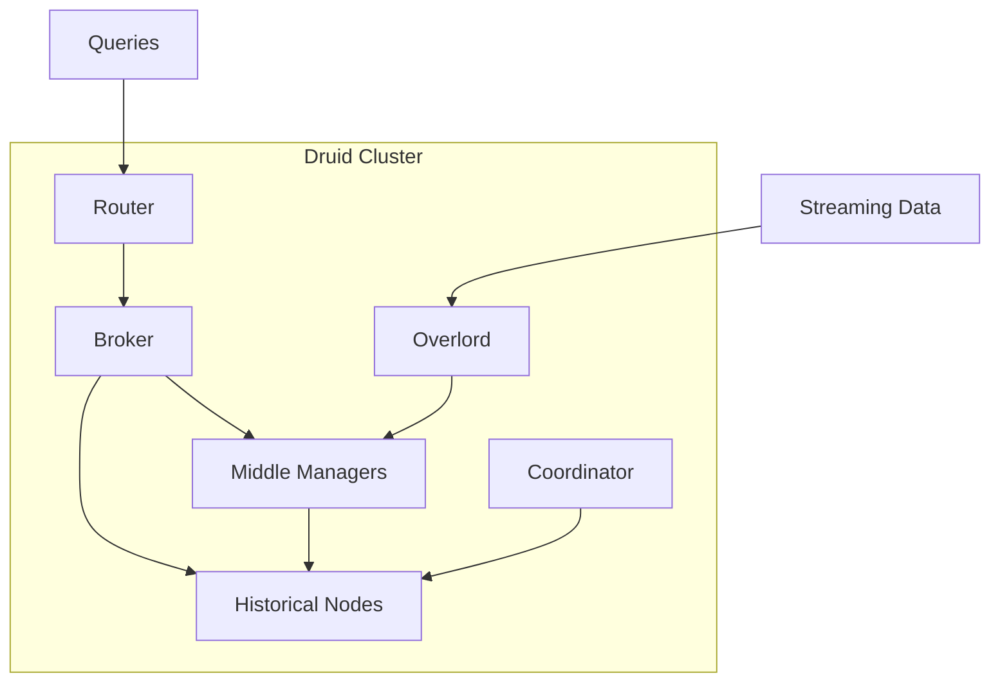
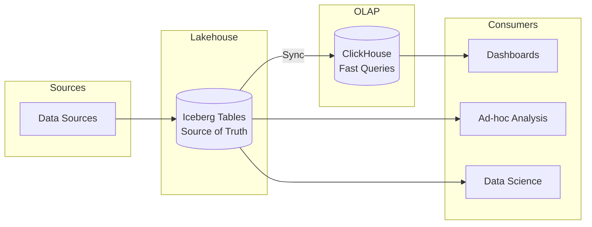
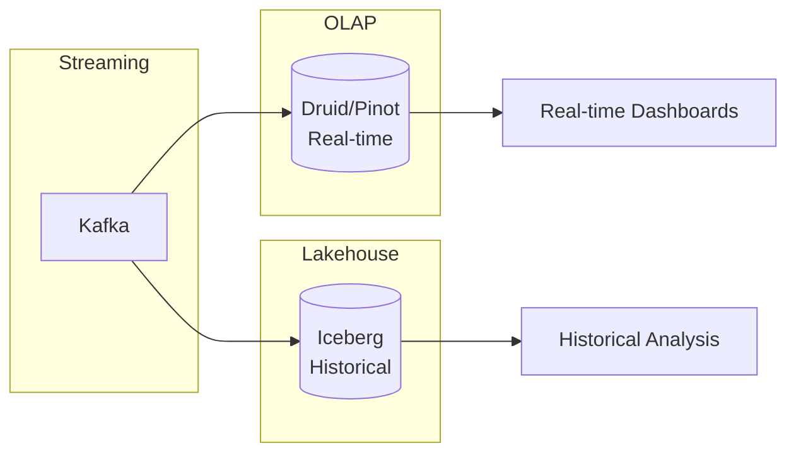
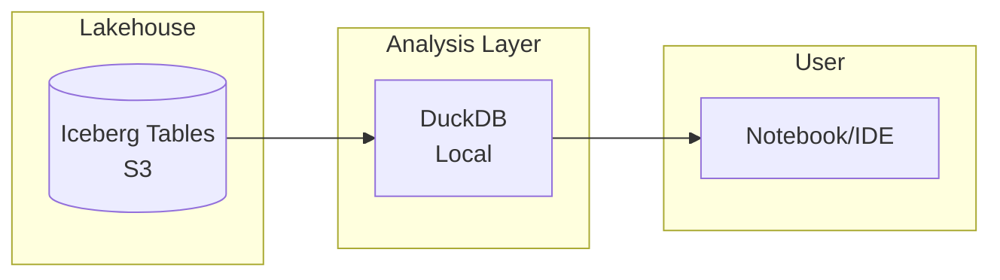
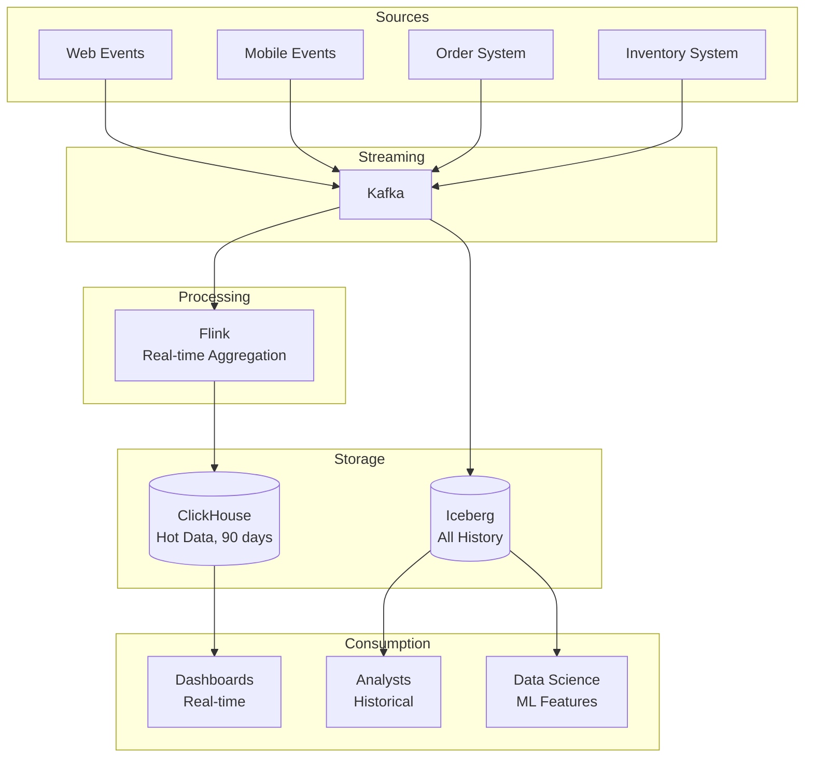

# Analytical Databases (OLAP)

Your lakehouse stores petabytes of historical data with ACID transactions and schema evolution. Query engines like Spark SQL and Trino can analyze it. But when a product manager opens the dashboard at 9 AM and waits 30 seconds for last night's sales numbers to load, something is wrong. The lakehouse is optimized for throughput, not latency. For interactive analytics with sub-second response times, you need something else.

This is where dedicated OLAP (Online Analytical Processing) databases enter the picture. Systems like ClickHouse, Apache Druid, and DuckDB are purpose-built for fast analytical queries—often 10-100x faster than querying lakehouse tables directly. But they come with trade-offs: additional operational complexity, data duplication, and synchronization challenges.

This chapter explores the OLAP category: how these systems achieve their performance, when they complement a lakehouse, and how to choose between them.

## The OLAP vs. OLTP Distinction

Before diving into specific systems, we need to understand why analytical databases exist as a separate category.

### OLTP: Online Transaction Processing

OLTP systems (PostgreSQL, MySQL, MongoDB) are designed for transactional workloads:

- **Access pattern:** Read/write individual records by key
- **Query shape:** `SELECT * FROM users WHERE id = 123`
- **Optimization goal:** Low latency for single-row operations
- **Concurrency:** Many simultaneous users doing small operations
- **Data organization:** Row-oriented storage

OLTP systems excel at powering applications: user logins, shopping cart updates, order placements.

### OLAP: Online Analytical Processing

OLAP systems are designed for analytical workloads:

- **Access pattern:** Scan many rows, return aggregated results
- **Query shape:** `SELECT category, SUM(revenue) FROM sales WHERE date > '2024-01-01' GROUP BY category`
- **Optimization goal:** High throughput for complex queries
- **Concurrency:** Fewer users running heavier queries
- **Data organization:** Column-oriented storage

OLAP systems excel at business intelligence: dashboards, reports, ad-hoc analysis.

### Why Not Just Use the Lakehouse?

Lakehouses (Iceberg tables queried by Spark/Trino) handle analytical workloads, but with limitations:

**Latency:** Query planning, file listing, and remote storage access add overhead. A simple aggregation might take 5-30 seconds even on modest data.

**Concurrency:** Spark clusters aren't designed for dozens of simultaneous dashboard queries. Each query consumes significant resources.

**Interactive exploration:** Analysts iterating rapidly—"let me try grouping by region instead"—are frustrated by 10-second waits between queries.

Dedicated OLAP databases optimize for these scenarios through aggressive caching, specialized indexes, and architectures designed for query concurrency.

## How OLAP Databases Achieve Performance

OLAP databases use several techniques to achieve sub-second query times on large datasets.

### Columnar Storage with Compression

Like Parquet files, OLAP databases store data column-by-column. But they go further:

**Aggressive encoding:** Run-length encoding, dictionary encoding, delta encoding, and frame-of-reference encoding minimize storage and maximize cache efficiency.

**Custom compression:** Column-aware compression achieves 10-20x compression ratios, meaning more data fits in memory and cache.

**Late materialization:** Keep data compressed as long as possible during query execution, decompressing only when needed.

### Vectorized Execution

Instead of processing one row at a time, vectorized engines process batches of values:

```
Traditional (row-at-a-time):
  for row in rows:
    result = compute(row.column_a, row.column_b)

Vectorized:
  column_a_batch = load_batch(column_a, 1000)
  column_b_batch = load_batch(column_b, 1000)
  results = simd_compute(column_a_batch, column_b_batch)  # Single CPU instruction
```

Modern CPUs have SIMD (Single Instruction, Multiple Data) instructions that process multiple values simultaneously. Vectorized execution exploits this for 10-100x speedups.

### Specialized Indexes

OLAP databases build indexes optimized for analytical access:

**Min/max indexes:** Track minimum and maximum values per data block. Skip blocks that can't contain matching values.

**Bloom filters:** Probabilistic structure that quickly determines "definitely not in this block" for membership queries.

**Inverted indexes:** For text and high-cardinality columns, map values to row locations.

**Bitmap indexes:** Efficient for low-cardinality columns (country, status, category).

### Pre-aggregation and Materialized Views

For predictable query patterns, pre-compute results:

**Rollups:** Pre-aggregate data at different granularities (daily, weekly, monthly).

**Materialized views:** Store query results that update incrementally.

**Data cubes:** Multi-dimensional pre-aggregation for slice-and-dice analysis.

### In-Memory Processing

OLAP databases assume data fits in memory (or at least hot data does):

**Memory-first architecture:** Keep working set in RAM, spill to disk only when necessary.

**Smart caching:** Cache frequently accessed columns, indexes, and query results.

**Predictive loading:** Anticipate which data will be needed based on query patterns.

## ClickHouse: The Performance King

ClickHouse, created at Yandex for web analytics, has become the leading open-source OLAP database for high-performance analytics.

### Architecture

ClickHouse is written in C++ as a single statically-linked binary with no external dependencies. Its architecture has three main layers:

**Query processing layer:** Parses SQL, optimizes query plans, and executes queries using a vectorized engine.

**Storage layer:** Manages columnar data files with compression, indexing, and merge operations.

**Integration layer:** Connects to external systems (Kafka, S3, databases) for data ingestion and federation.



### MergeTree: The Core Storage Engine

ClickHouse's MergeTree engine family is optimized for analytical workloads:

**Immutable parts:** Data is written in immutable parts that are later merged in the background.

**Primary key ordering:** Data is sorted by primary key, enabling efficient range scans.

**Sparse indexes:** Unlike B-tree indexes that point to individual rows, sparse indexes point to blocks (typically 8,192 rows), keeping index size small.

**Partitioning:** Data is partitioned (usually by date) for efficient pruning and management.

```sql
CREATE TABLE events (
    event_time DateTime,
    event_type String,
    user_id UInt64,
    value Float64
)
ENGINE = MergeTree()
PARTITION BY toYYYYMM(event_time)
ORDER BY (event_type, user_id, event_time);
```

### 2025 Features

ClickHouse continues rapid development:

**SharedCatalog:** Centralized metadata coordination for cloud deployments, enabling cloud-scale DDL operations and stateless compute.

**Warehouses:** True compute-compute separation with read-write and read-only designations for cost and performance optimization.

**Query Condition Cache:** Remembers which data ranges satisfy WHERE conditions, reusing this as an ephemeral index.

**Improved Parquet support:** Rewritten Parquet reader for better performance with lakehouse data.

**Open format support:** Native reading of Iceberg and Delta Lake tables.

### When to Use ClickHouse

**Ideal scenarios:**
- Real-time analytics dashboards
- High-volume event/log analysis
- Time-series aggregations
- Ad tech (billions of events, sub-second queries)
- IoT sensor data analysis

**Scale:** Customers like Tesla have ingested over a quadrillion rows. GitLab serves sub-second queries to tens of millions of users.

**Strengths:**
- Extremely fast analytical queries (often fastest in benchmarks)
- Efficient compression (10-20x typical)
- Scales from single node to hundreds of nodes
- Strong SQL support
- Active development community

**Limitations:**
- Not designed for transactional updates (updates are expensive)
- Complex to operate at scale
- Limited join performance compared to traditional databases
- Learning curve for optimal schema design

## DuckDB: The Embedded Analyst

DuckDB takes a radically different approach: instead of a server, it's an embedded database that runs inside your application—like "SQLite for analytics."

### Architecture

DuckDB runs entirely in-process:

```python
import duckdb

# No server, no connection string—just import and query
conn = duckdb.connect()
result = conn.execute("""
    SELECT category, SUM(amount)
    FROM 's3://bucket/sales/*.parquet'
    GROUP BY category
""").fetchdf()
```

**In-process execution:** DuckDB runs in the same process as your application (Python, R, Java, Node.js).

**Zero dependencies:** Single library, no external services required.

**Larger-than-memory processing:** Spills to disk for datasets exceeding RAM.

**Direct file access:** Queries Parquet, CSV, JSON files directly—including from S3, GCS, and Azure.

### Vectorized Columnar Engine

Despite its simplicity, DuckDB is highly optimized:

**Vectorized execution:** Processes data in batches using SIMD instructions.

**Columnar storage:** Native columnar format for persistent tables.

**Parallel execution:** Utilizes all CPU cores automatically.

**Query optimization:** Sophisticated optimizer with join reordering, predicate pushdown, etc.

**Performance:** Often 100-1000x faster than SQLite or PostgreSQL for analytical queries.

### Use Cases

**Interactive analysis:**
```python
# Explore data directly from laptop
import duckdb
duckdb.sql("SELECT * FROM 'data.parquet' WHERE date > '2024-01-01'")
```

**Data pipelines:**
```python
# Transform data efficiently
duckdb.sql("""
    COPY (
        SELECT date, SUM(amount) as total
        FROM 's3://bucket/raw/*.parquet'
        GROUP BY date
    ) TO 's3://bucket/aggregated/daily.parquet'
""")
```

**Embedded analytics:**
```python
# Add analytics to existing applications
# No separate database server needed
app_db = duckdb.connect('analytics.db')
app_db.execute("CREATE TABLE metrics AS SELECT * FROM 'new_data.parquet'")
```

### When to Use DuckDB

**Ideal scenarios:**
- Local data analysis (laptop, workstation)
- Data pipeline transformations
- Embedded analytics in applications
- Querying lakehouse data for prototyping
- Datasets up to ~1 billion rows

**Strengths:**
- Zero operational overhead (no server)
- Excellent developer experience
- Direct lakehouse file access
- Works everywhere (Python, R, CLI, browser via WebAssembly)
- Free and open source

**Limitations:**
- Single-machine only (no distributed queries)
- Not designed for high concurrency (embed in each process)
- Limited to datasets that fit on one machine
- No real-time ingestion (batch-oriented)

## Apache Druid: Real-Time at Scale

Apache Druid is designed for real-time analytics on streaming data at massive scale.

### Architecture

Druid uses a distributed architecture with specialized node types:

**Coordinator nodes:** Manage data availability and replication.

**Overlord nodes:** Control data ingestion workloads.

**Broker nodes:** Handle queries, routing to appropriate data nodes.

**Historical nodes:** Serve queries on immutable historical data.

**Middle Manager nodes:** Handle real-time ingestion.

**Router nodes (optional):** Route requests to coordinators, brokers, or overlords.



### Segments and Real-Time Ingestion

Druid organizes data into **segments**—immutable chunks of data, typically covering a time range.

**Real-time ingestion:** Data streams into Middle Managers, becoming queryable immediately. Periodically, real-time data is published as immutable segments.

**Streaming sources:** Native connectors for Kafka, Kinesis, and other streaming platforms.

**Sub-second latency:** New events are queryable within seconds of arrival.

### When to Use Druid

**Ideal scenarios:**
- Real-time dashboards on streaming data
- Event-driven analytics (user activity, IoT, logs)
- Time-series analysis at scale
- High-concurrency query workloads

**Strengths:**
- True real-time ingestion and querying
- Scales to trillions of rows
- High query concurrency
- Time-series optimized

**Limitations:**
- Complex to operate (multiple node types)
- Limited SQL support (improving but not full SQL)
- No updates or deletes (immutable segments)
- Significant resource requirements

## Apache Pinot: Real-Time User-Facing Analytics

Apache Pinot, created at LinkedIn, is designed for user-facing analytics—serving queries to millions of concurrent users.

### Key Differentiators

**User-facing focus:** Optimized for high query concurrency (thousands of QPS) with predictable low latency.

**Real-time ingestion:** Like Druid, supports streaming from Kafka with immediate queryability.

**Upserts:** Unlike Druid, supports upsert semantics for certain use cases.

**StarTree Index:** Unique pre-aggregation index that dramatically accelerates group-by queries.

### When to Use Pinot

**Ideal scenarios:**
- User-facing dashboards with many concurrent users
- LinkedIn-style "Who viewed your profile" analytics
- Real-time metrics for consumer applications

**Compared to Druid:** Pinot focuses more on user-facing use cases with higher concurrency requirements; Druid is more common for internal analytics dashboards.

## Comparison Matrix

| Aspect | ClickHouse | DuckDB | Druid | Pinot |
|--------|------------|--------|-------|-------|
| **Deployment** | Server/cluster | Embedded | Distributed cluster | Distributed cluster |
| **Scale** | TB-PB, multi-node | GB-TB, single node | PB+, multi-node | PB+, multi-node |
| **Latency** | Sub-second | Sub-second | Sub-second | Sub-second |
| **Concurrency** | Medium-high | Low (per-process) | High | Very high |
| **Real-time ingestion** | Yes | No (batch) | Yes (core feature) | Yes (core feature) |
| **Updates** | Limited | Yes | No | Limited (upserts) |
| **SQL support** | Excellent | Excellent | Limited | Limited |
| **Operations** | Medium | None | Complex | Complex |
| **Best for** | General OLAP | Local analytics | Streaming analytics | User-facing analytics |

## OLAP + Lakehouse: Architecture Patterns

The question isn't "OLAP or lakehouse?"—it's "how do they work together?"

### Pattern 1: Lakehouse as Source of Truth, OLAP for Speed



**How it works:**
1. All data lands in the lakehouse (Iceberg/Delta tables)
2. Curated datasets are synced to ClickHouse for dashboards
3. Ad-hoc analysis and data science query the lakehouse directly

**Sync mechanisms:**
- Scheduled batch jobs (hourly/daily)
- CDC from lakehouse to ClickHouse
- ClickHouse reading Iceberg tables directly (new feature)

**Benefits:**
- Single source of truth in lakehouse
- Fast dashboards via ClickHouse
- No compromise on either capability

**Challenges:**
- Data duplication
- Sync lag (not real-time)
- Additional operational complexity

### Pattern 2: Streaming to OLAP, Batch to Lakehouse



**How it works:**
1. Streaming data flows to both OLAP (real-time) and lakehouse (historical)
2. OLAP serves real-time dashboards
3. Lakehouse serves historical and ad-hoc analysis

**Benefits:**
- True real-time analytics
- Complete historical record in lakehouse
- Each system optimized for its use case

**Challenges:**
- Dual pipelines to maintain
- Potential consistency differences
- Higher infrastructure cost

### Pattern 3: DuckDB as Lakehouse Accelerator



**How it works:**
1. Data lives in lakehouse (Iceberg tables on S3)
2. Analysts use DuckDB locally to query lakehouse files
3. No separate OLAP infrastructure needed

**Benefits:**
- Zero additional infrastructure
- Excellent developer experience
- Direct lakehouse access

**Limitations:**
- Single-user pattern (not for dashboards)
- Limited to data sizes a laptop can handle
- Requires network access to object storage

## Decision Framework

### When to Add an OLAP Database

Add a dedicated OLAP database when:

1. **Dashboard latency is critical:** Users expect sub-second response times
2. **Concurrency is high:** Dozens or hundreds of simultaneous dashboard users
3. **Real-time is required:** Data must be queryable within seconds of arrival
4. **Query patterns are predictable:** You can optimize schemas for known queries

Don't add an OLAP database when:

1. **Batch latency is acceptable:** Users are fine with queries taking 10-30 seconds
2. **Concurrency is low:** A handful of analysts running ad-hoc queries
3. **Data freshness is daily:** Overnight batch loads are sufficient
4. **Complexity budget is exhausted:** Team can't take on another system

### Choosing an OLAP Database

```
START: What's your deployment model?

├─ Embedded (no server)
│   └─ DuckDB
│       - Best for: local analysis, embedded analytics
│       - Not for: multi-user dashboards, real-time ingestion
│
├─ Server/cluster, general OLAP
│   └─ ClickHouse
│       - Best for: fastest queries, good SQL, flexible
│       - Consider if: you need best raw performance
│
├─ Server/cluster, real-time streaming focus
│   ├─ User-facing (high concurrency)?
│   │   └─ Apache Pinot
│   │       - Best for: LinkedIn-style per-user analytics
│   │
│   └─ Internal dashboards?
│       └─ Apache Druid
│           - Best for: event analytics, time-series
│
└─ Managed service preferred?
    └─ Consider:
        - ClickHouse Cloud
        - Rockset (real-time analytics service)
        - Firebolt (cloud data warehouse)
```

## Case Study: E-commerce Analytics Platform

Let's design an analytics platform for an e-commerce company:

### Requirements

- **Sales dashboards:** Real-time revenue, orders, conversion rates
- **User behavior:** Session analysis, funnel visualization
- **Inventory:** Stock levels, reorder alerts
- **Historical analysis:** Trend analysis, cohort studies
- **Scale:** 10M events/day, 5 years of history

### Architecture



### Implementation Details

**Real-time path:**
- Events stream through Kafka
- Flink computes real-time aggregations (minute-level rollups)
- ClickHouse stores 90 days of granular data plus rollups
- Dashboards query ClickHouse with sub-second latency

**Historical path:**
- All events land in Iceberg tables (append-only)
- 5-year retention for compliance and analysis
- Analysts use Spark/Trino for ad-hoc queries
- Data science uses lakehouse for ML training data

**Synchronization:**
- ClickHouse receives real-time via Flink
- Daily job backfills any corrections from Iceberg

### Why This Architecture?

**Why ClickHouse for dashboards?**
- Sub-second queries for executive dashboards
- Handles concurrent dashboard users efficiently
- Excellent time-series aggregations

**Why Iceberg for history?**
- Cost-effective long-term storage
- Schema evolution as business changes
- Time travel for debugging and auditing

**Why not just one system?**
- ClickHouse: 90 days × 10M events/day = 900M rows (manageable)
- 5 years in ClickHouse: 18B rows, expensive storage
- Iceberg on S3: 100x cheaper for cold data

## Summary

This chapter explored the OLAP database category:

**Why OLAP databases exist:**
- Lakehouses optimize for throughput; OLAP optimizes for latency
- Sub-second queries require specialized architecture
- High dashboard concurrency needs purpose-built systems

**How they achieve performance:**
- Columnar storage with aggressive compression
- Vectorized execution using SIMD instructions
- Specialized indexes (sparse, bloom, bitmap)
- Pre-aggregation and materialized views
- In-memory processing with smart caching

**Major OLAP systems:**

| System | Best For |
|--------|----------|
| **ClickHouse** | General OLAP, best raw performance |
| **DuckDB** | Embedded analytics, local analysis |
| **Druid** | Real-time streaming analytics |
| **Pinot** | User-facing high-concurrency analytics |

**Integration patterns:**
- Lakehouse as source of truth, OLAP for speed
- Streaming to OLAP, batch to lakehouse
- DuckDB as lakehouse accelerator

**Decision guidance:**
- Add OLAP when latency/concurrency demands exceed lakehouse capabilities
- Choose based on deployment model and real-time requirements
- Most organizations benefit from lakehouse + OLAP hybrid

**Looking ahead:**
- Chapter 7 covers distributed compute fundamentals—the theory underlying Spark and other processing engines
- Chapter 8 dives deep into Apache Spark
- Chapter 15 presents complete architecture patterns combining all components

## Further Reading

- ClickHouse Documentation: https://clickhouse.com/docs/
- DuckDB Documentation: https://duckdb.org/docs/
- Apache Druid Documentation: https://druid.apache.org/docs/latest/
- Apache Pinot Documentation: https://docs.pinot.apache.org/
- "ClickHouse: The Real-Time Data Warehouse" (ClickHouse team)
- Uber Engineering Blog: "AresDB" and "Apache Pinot at Uber"
